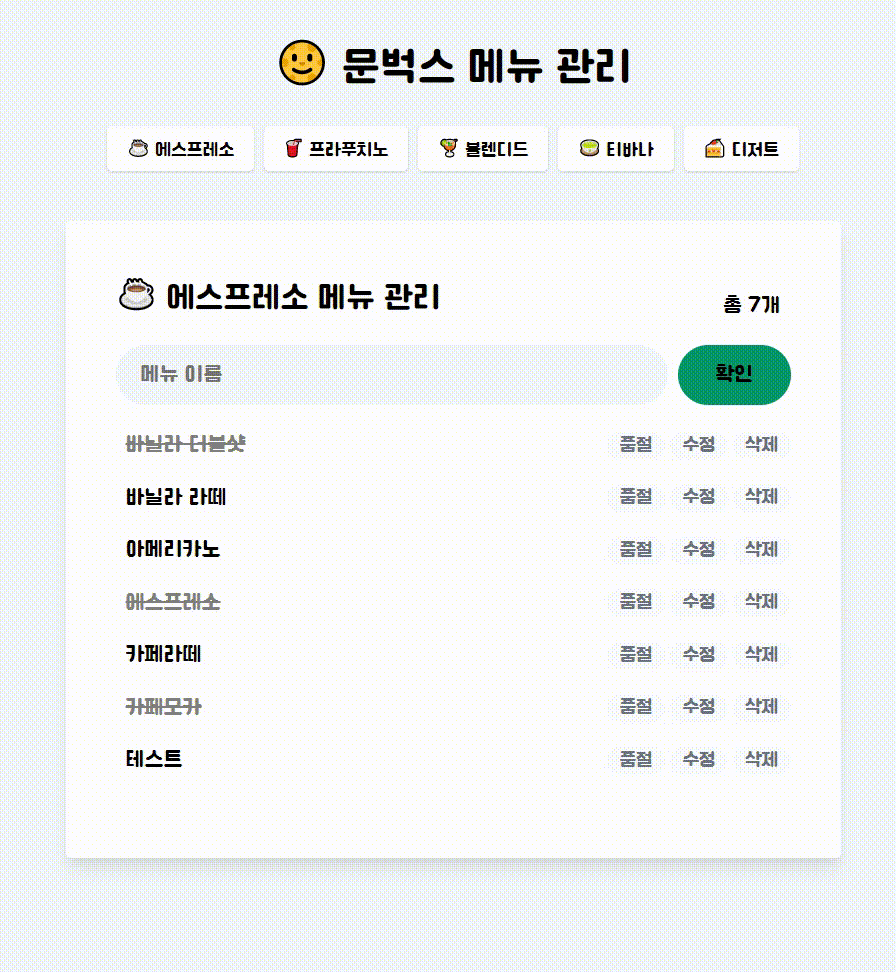

 

  

<h2 align="middle">JS 문벅스 카페메뉴 앱</h2>

Vanilla JS로 구현 하는 상태관리가 가능한 카페메뉴 앱

 
<h3 align="middle">Result</h3>

  

# 🎯 step1 요구사항 - 돔 조작과 이벤트 핸들링으로 메뉴 관리하기

## WHAT I LEARNED

1. 함수 분리를 어떻게 할지 배웠다.
2. document.querySelector를 $ 함수로 빼서 간략하게 할 수 있다는걸 알게 되었다.
3. insertAdjacentHtml, closest 같은 새로운 method를 알게 되었다.

## TODO 메뉴 추가

- [x] 메뉴의 이름을 입력받고 확인 버튼을 누르면 메뉴가 추가된다.
- [x] 메뉴의 이름을 입력받고 엔터키를 누르면 메뉴가 추가된다.
- [x] 추가되는 메뉴의 아래 마크업은 `<ul id="menu-list" class="mt-3 pl-0"></ul>` 안에 삽입해야 한다.
- [x] 총 메뉴 개수를 count하여 상단에 보여준다.
- [x] 메뉴가 추가되고 나면, input은 빈 값으로 초기화한다.
- [x] 사용자 입력값이 빈 값이라면 추가되지 않는다.

### 하고싶은 것

- [ ] 빈값이 아닐 경우 확인 버튼이 활성화된다.

## TODO 메뉴 수정

- [x] 메뉴의 수정 버튼을 누르면 메뉴를 수정할 수 있는 모달이 팝업된다.
- [x] 메뉴 수정 모달은 `prompt` 인터페이스를 활용한다.
- [x] 기존 메뉴 이름이 input field에 default value로 들어오며, 확인버튼을 누르면 메뉴가 수정된다.

## TODO 메뉴 삭제

- [x] 메뉴 삭제 버튼을 누르면 메뉴 삭제 모달이 팝업된다.
- [x] 메뉴 삭제시 브라우저에서 제공하는 `confirm` 인터페이스를 활용한다.
- [x] 확인 버튼을 누르면 메뉴가 삭제된다.
- [x] 총 메뉴 갯수를 count하여 상단에 보여준다.

# 🎯 STEP 2 요구사항 - 상태 관리로 메뉴 관리하기

## WHAT I LEARNED

1. module로 util과 store를 분리하여 코드를 깔끔하게 관리할 수 있다.
2. this keyword를 쓰려면 결국 contructor가 필요하기 때문에 fucntion을 써야 한다.
3. 혹시 나중에 메뉴 카테고리가 추가될 수 있으니 동적으로 받아오게 했다.
   - 근데 이미 html에 하드코딩 되어있어서 진짜 동적으로 하고싶으면 이부분까지 js로 렌더링하도록 수정해야할 것 같다.

## TODO localStroage Read & Write

- [x] localStorage에 데이터를 저장한다.
  - [x] 메뉴를 추가할 때
  - [x] 메뉴를 수정할 때
  - [x] 메뉴를 삭제할 때
- [x] localStorage에 있는 데이터를 읽어온다.

## TODO 카테고리별 메뉴판 관리

- [x] 메뉴 (에스프레소, 프라푸치노, 블렌디드, 티바나, 디저트)는 배열에 담아서 가져온다.
- [x] 메뉴 각각의 종류별로 메뉴판을 관리할 수 있게 만든다.

> 메뉴 종류도 서버에서 관리하고 가져오고 싶은데 이미 웹서버에 메뉴 종류가 지정되어 있어서 DB 변경하지 않는 이상 불가능하다..

## TODO 페이지 접근시 최초 데이터 Read & Rendering

- [x] 페이지에 최초로 접근할 때는 localStorage에서 에스프레소 메뉴를 읽어온다.
- [x] 에스프레소 메뉴를 페이지에 렌더링한다.

## TODO 품절 상태 관리

- [x] 품절 상태인 경우를 보여줄 수 있게, 품절 버튼을 추가하고 `sold-out` class를 추가하여 상태를 변경한다.
- [x] 품절 버튼을 추가한다.
- [x] 품절 버튼을 클릭시 localStorage에 상태값이 저장된다.
- [x] 품절 메뉴의 classList에 `sold-out`을 추가한다.

# 🎯 step3 요구사항 - 서버와의 통신을 통해 메뉴 관리하기

## WHAT I LEARNED

- async & await: 카페 진동벨처럼 순서를 보장
- promise는 response.json()을 return하면 받을 수 있다.
- 코드 리팩토링하는 부분
  - fetch 보내는 부분을 리팩토링하니 엄청 깔끔해졌다.
  - option 부분도 POST, PUT, DELETE를 이렇게 분리할 수 있다니 신기하고 깔끔해서 좋았다.

## TODO 서버 요청 부분

- [x] 웹 서버 저장소를 clone하여 로컬에서 웹 서버를 실행시킨다.
- [x] 서버에 새로운 메뉴 추가를 요청한다.
- [x] 서버에서 카테고리별 메뉴 목록을 불러온다.
- [x] 서버에 품절상태 toggle을 요청한다.
- [x] 서버에 수정된 메뉴 이름으로 기존 메뉴 이름이 바뀌도록 요청한다.
- [x] 서버에 메뉴 삭제를 요청한다.

## TODO 리팩토링

- [x] localStorage에 저장하는 로직은 지운다.
- [x] fetch 비동기 api를 사용하는 부분을 async await을 사용하여 구현한다.
- [x] api 호출 객체 추상화

## TODO 사용자 경험

- [x] API 통신이 실패하는 경우에 대해 사용자가 알 수 있게 alert로 예외처리를 진행한다.
- [x] 중복되는 메뉴는 추가할 수 없다.
